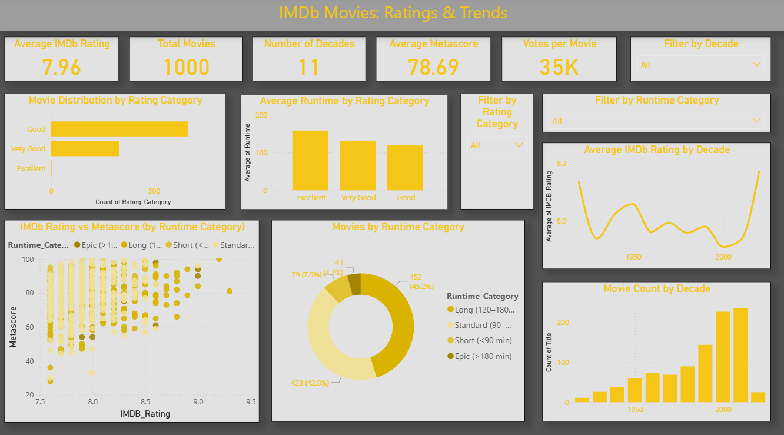

# Power BI Dashboard

This folder contains the Power BI dashboard and related assets.

## 📊 Dashboard Features
- **Cards**: Average IMDb Rating, Total Movies, Number of Decades, Average Metascore, Votes per Movie  
- **Slicers**: Decade, Rating Category, Runtime Category  
- **Visuals**:
  - Movie Distribution by Rating Category
  - Average Runtime by Rating Category
  - Average IMDb Rating by Decade
  - IMDb Rating vs Metascore (by Runtime Category)
  - Movies by Runtime Category (Donut)
  - Movie Count by Decade

## 📁 Files
- `IMDb_Trends.pbix` → Power BI file
- `imdb_trends.PNG` → Dashboard screenshot
- 

