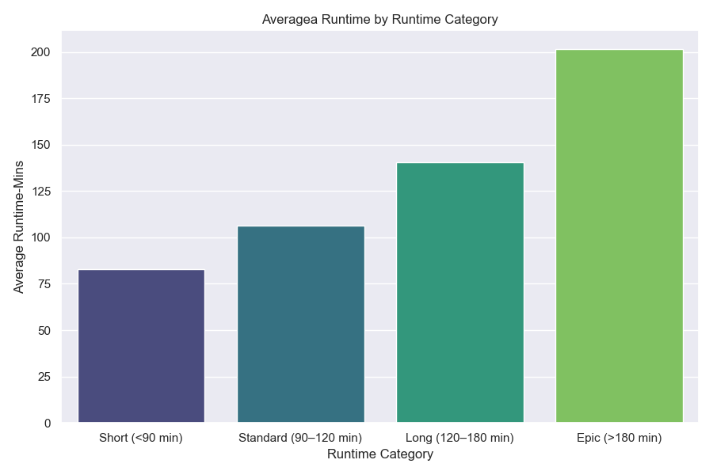
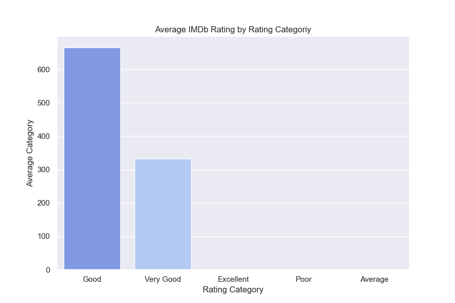
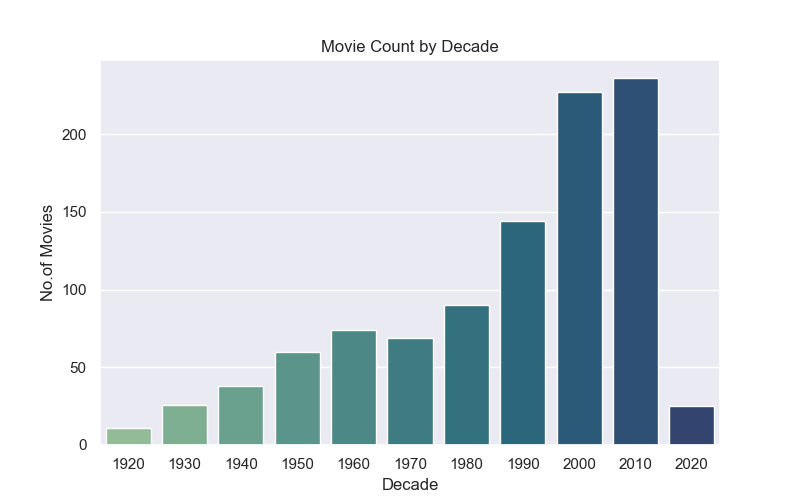
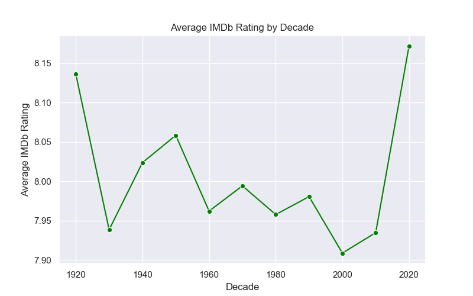
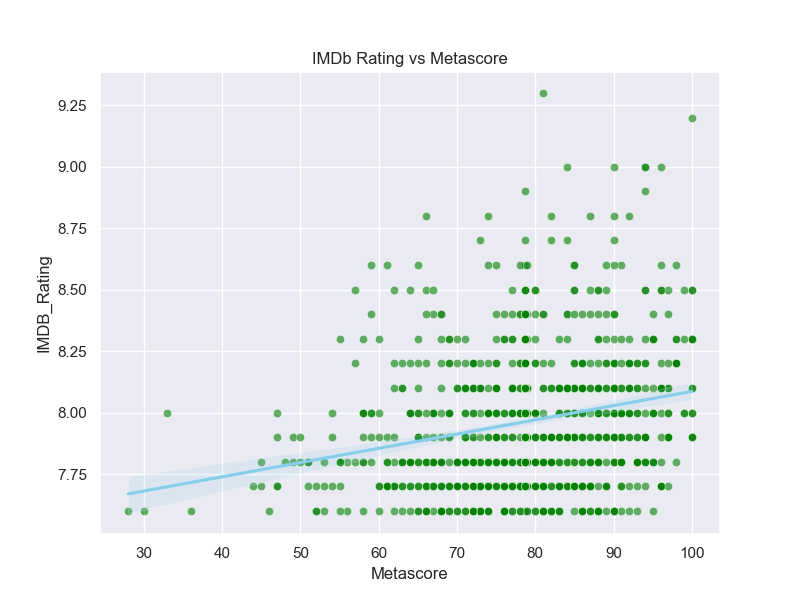
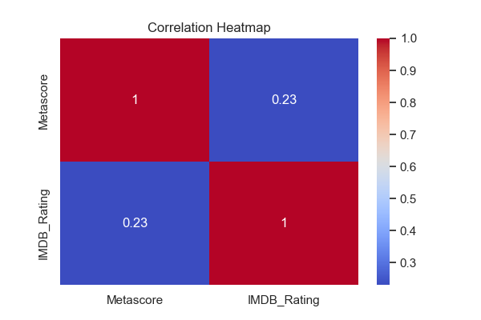

# Python Analysis

This folder contains the Python-based data cleaning and visualization steps for the IMDb dataset.

## 📌 Steps
1. Data cleaning & transformation (removing unwanted columns, fixing types)
2. Feature engineering (Decade, Rating Category, Runtime Category)
3. Visualizations:
   - Average Runtime by Runtime Category
   - Average Rating by Rating Category
   - Movie Count by Decade
   - Average Rating by Decade
   - IMDb Rating vs Metascore Scatter
   - Correlation Heatmap

## 📁 Files
- `imdb_cleaning_visuals.py` → Main script
- `IMDB_Cleaned.csv` → Cleaned dataset (ready for Power BI)
- `requirements.txt` → Dependencies

## Visualizations

### 1. Average Runtime of Movies

### 2. Average IMDB Rating

### 3. Movie Count by Decade

### 4. Average Rating by Decade

### 5. Votes vs Rating (Scatter Plot)

### 6. Votes vs Rating (Heatmap)

