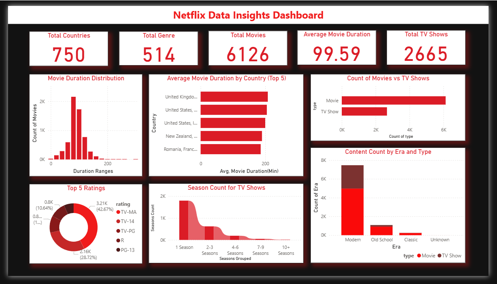
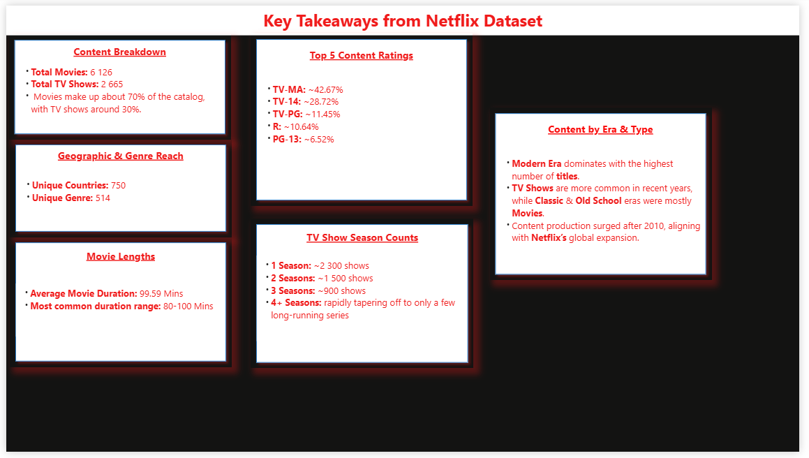

# Netflix Titles — Power BI Dashboard

This Power BI project is based on the **cleaned Netflix dataset** exported from a Jupyter Notebook (Python EDA).  
The dataset was cleaned, transformed, and saved as `cleaned_netflix_data.csv`, which is used as the data source for the visuals.

---

## Data Source & Preparation
- **Source:** Kaggle — *Netflix Movies and TV Shows* dataset.
- **Cleaning & Export:** Done in Python (`netflix_eda.ipynb`) using Pandas & Seaborn/Matplotlib for initial EDA.
- **Exported File:** `cleaned_netflix_data.csv` (used in Power BI).
- **Note:** If the CSV file is renamed or moved, you must update the file path in Power BI to restore the connection.
- **Removed Rows:** A small number of rows were removed due to CSV errors.

---

## Power BI Visuals Used
- **Cards:** Total Countries, Total Genres, Total Movies, Average Movie Duration, Total TV Shows.
- **Stacked Column Chart:** Movie Duration Distribution.
- **Clustered Bar Chart:** Average Movie Duration (Top 5 Countries), Count of Movies vs TV Shows.
- **Donut Chart:** Top 5 Ratings.
- **Ribbon Chart:** TV Show Season Counts.
- **Stacked Column Chart:** Content Count by Era & Type.

---

## Dashboard — Visuals Page

---

## Dashboard — Key Takeaways Page

---

## Key Insights
1. **Content Breakdown:** ~6,126 Movies, ~2,665 TV Shows (Movies ≈ 70% of catalog).
2. **Reach:** 750 unique countries, 514 unique genres.
3. **Movie Lengths:** Avg. ≈ 99.59 mins, most common range 80–100 mins.
4. **Ratings:** Top categories are TV-MA (~42.7%) and TV-14 (~28.7%).
5. **Seasons:** Most TV shows have 1–2 seasons; very few exceed 4+ seasons.
6. **Era:** Modern era dominates; TV Shows more common in recent years; post-2010 production surge.

---

## Included Files
- `netflix.pbix` — full interactive Power BI dashboard file.
- `cleaned_netflix_data.csv` — cleaned dataset for Power BI.
- `visuals/pb1.PNG` — dashboard screenshot (visuals page).
- `visuals/pb1_takeaways.PNG` — dashboard screenshot (key takeaways page).

---

## Notes
- Keep the CSV and `.pbix` in the same folder to avoid broken links.
- Use **Refresh** in Power BI to update visuals after any CSV changes.
- Dataset cleaning and transformation details are in `netflix_eda.ipynb`.

---
