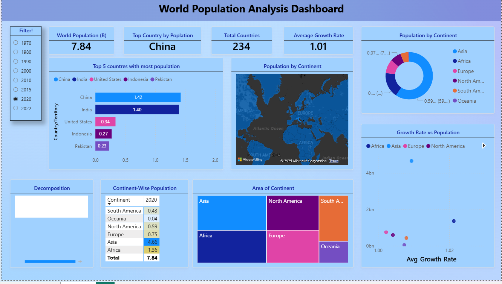

# 📊 Power BI Dashboard

This folder contains the interactive dashboard created using the cleaned dataset.

---

## Data Modeling
- **Fact Table:** Population (CCA3, Year, Population)
- **Dimension Tables:**
  - `DimCountry` → Country/Territory, Continent, Area, Growth Rate, World Population %
  - `DimYear` → List of years for slicers
- **Relationships:** Linked via `CCA3` (Country code) and `Year`.

This star schema improves performance and readability.

---

## Measures
- **Total Population** = SUM(FactPopulation[Population])
- **World Population (B)** = DIVIDE([Total Population], 1e9)
- **Average Growth Rate** = AVERAGE(DimCountry[Growth_Rate])
- **Countries Count** = DISTINCTCOUNT(DimCountry[CCA3])
- **Country Rank by Population** = RANKX(...)

---

## Visuals
- **Cards:** World Population (B), Top Country by Population, Total Countries, Avg Growth Rate
- **Top 5 Populated Countries:** Bar Chart
- **Donut Chart:** Population % by Continent
- **Map:** Population distribution globally
- **Matrix:** Continent-wise population (by year)
- **Treemap:** Area of continents
- **Scatter Plot:** Growth Rate vs Population
- **Decomposition Tree:** Total population explained by Continent → Country

---

## Dashboard Preview

