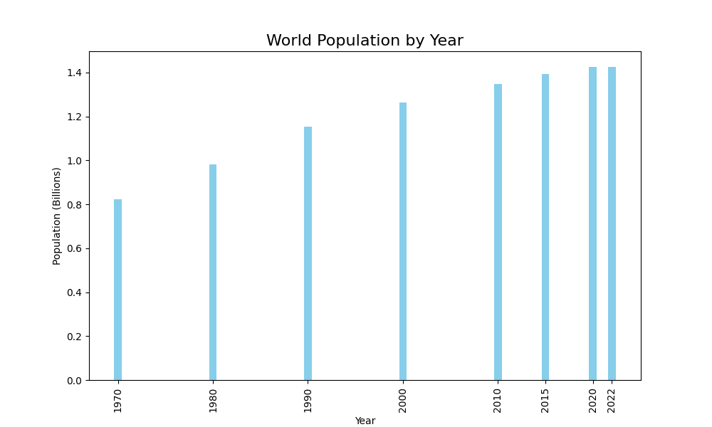

# 🐍 Python Analysis

This folder contains data cleaning, transformation, and exploratory analysis for the **World Population Dataset**.

---

## Steps
1. **Data Cleaning:**
   - Removed spaces from column names.
   - Checked for duplicates and missing values.
   - Created new features like `pop_dif_1970vs2022`.

2. **Exploratory Analysis:**
   - Population growth of India across decades.
   - Top 10 populated countries (2022).
   - Average growth rate by continent.
   - Correlation heatmap of numeric variables.

3. **Reshaping Data:**
   - Converted wide format (yearly columns) → long format (`Year`, `Population`) for time series analysis.

4. **Exports:**
   - Saved cleaned dataset as `cleaned_world_population.csv` for Power BI.

---

## Visuals
- **Bar Plot:** World population by year  
  

- **Correlation Heatmap:**  
  

- **Pair Plot:**  
  
