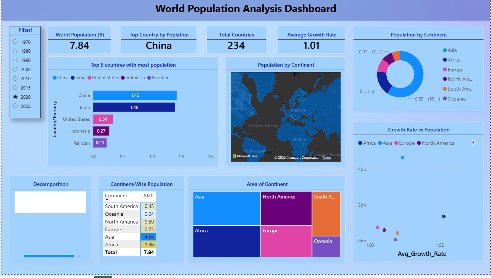

# 🌍 World Population Analysis (1970–2022)

This project analyzes the **world population dataset** from 1970 to 2022 using **Python (EDA, data cleaning, correlation analysis)** and **Power BI (interactive dashboarding)**.  

It highlights **population trends, growth rates, country/continent comparisons, and insights into area vs density relationships**.

---

## 📂 Project Structure
- **Python/** → Data cleaning, preprocessing, EDA, and exporting cleaned dataset.
- **PowerBI/** → Dashboard built on the cleaned dataset with advanced visuals.
- **Data/** → Raw Dataset.

---

## 🔑 Key Insights
1. **World population grew from ~3.7B (1970) to 7.8B (2022).**
2. **Asia dominates** with more than half the global population, led by **China and India**.
3. **Top 5 populated countries (2022):** China, India, USA, Indonesia, Pakistan.
4. **Africa shows the highest growth rate**, while Europe has a declining/steady trend.
5. **Correlation heatmap:** Population is moderately correlated with country area, but **density & growth rate show weak correlations**.
6. **India is projected to surpass China** (visible from narrowing gap).
7. **Decomposition & scatter plots** reveal that **population size does not necessarily imply higher growth rates**.
8. Splitting tables into **Fact (Population)** and **Dimensions (Country, Year)** in Power BI improved performance and made measures simpler.

---

## 📊 Dashboard Preview (Power BI)

---

## 🛠 Tools Used
- **Python:** Pandas, Matplotlib, Seaborn
- **Power BI:** Cards, Slicers, Decomposition Tree, Donut Chart, Treemap, Matrix, Map, Scatter Plot

---
